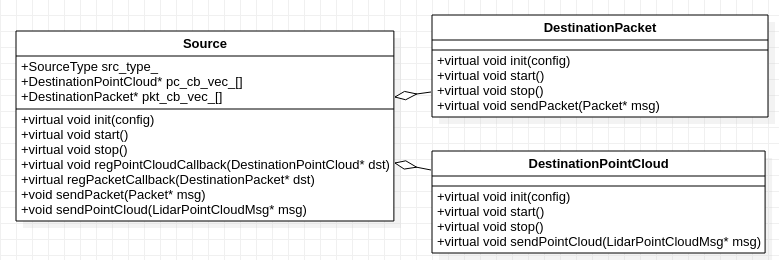
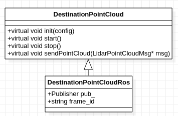
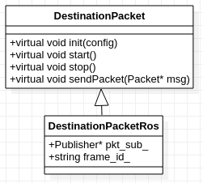
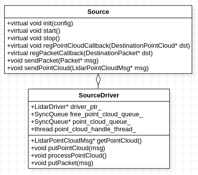
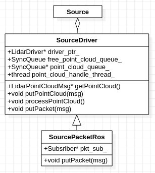
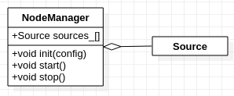

# rslidar_sdk v1.5.7 源代码解析

## 1 简介

rslidar_sdk是基于ROS/ROS2的雷达驱动。rslidar_sdk依赖rs_driver接收和解析MSOP/DIFOP Packet。

rslidar_sdk的基本功能如下：
+ 从在线雷达或PCAP文件得到点云，通过ROS主题`/rslidar_points`发布。使用者可以订阅这个主题，在rviz中看到点云。
+ 从在线雷达得到原始的MSOP/DIFOP Packet，通过ROS主题`/rslidar_packets`发布。使用者可以订阅这个主题，将Packet记录到rosbag文件。
+ 从ROS主题`/rslidar_packets`得到MSOP/DIFOP Packet，解析得到点云，再发布到主题`/rslidar_points`。
  + 这里的主题`/rslidar_packets`，由使用者通过回放Packet rosbag文件发布。

## 2 Source 与 Destination

如前面所说，rslidar_sdk从在线雷达、PCAP文件、ROS主题这三种源得到MSOP/DIFOP Packet，将Packet发布到ROS主题/rslidar_packets`/rslidar_packets`，将点云发布到目标 - ROS主题`/rslidar_points`。
+ Source定义源接口
+ DestinationPointCloud定义发送点云的目标接口。
+ DestinationPacket定义发送MSOP/DIFOP Packet的目标接口。



### 2.1 DestinationPointCloud

DestinationPointCloud定义发送点云的接口。
+ 虚拟成员函数init()对DestinationPointCloud实例初始化
+ 虚拟成员函数start()启动实例
+ 虚拟成员函数sendPointCloud()发送PointCloud消息

### 2.2 DestinationPacket

DestinationPacket定义发送MSOP/DIFOP Packet的接口。
+ 虚拟成员函数init()对DestinationPacket实例初始化
+ 虚拟成员函数start()启动实例
+ 虚拟成员函数sendPacket()启动发送Packet消息

### 2.3 Source

Source是定义源的接口。

+ 成员`src_type_`是源的类型

  ```
  enum SourceType
  {
    MSG_FROM_LIDAR = 1,
    MSG_FROM_ROS_PACKET = 2,
    MSG_FROM_PCAP = 3,
  };
  ```

+ 成员`pc_cb_vec_[]`中是一组DestinationPointCloud的实例。
  + 成员函数sendPointCloud()调用`point_cb_vec_[]`中的实例，发送点云消息。
+ 成员`pkt_cb_vec_[]`中是一组DestinationPacket实例。
  + 成员函数sendPacket()将Packet消息发送到`pkt_cb_vec_[]`中的实例中。

+ 虚拟成员函数init()初始化Source实例
+ 虚拟成员函数start()启动实例
+ 虚拟成员函数regPointCloudCallback()将PointCloudDestination实例注册到`point_cb_vec_[]`。
+ 虚拟成员函数regPacketCallback()将PacketDestination实例注册到`packet_cb_vec_[]`。

### 2.4 DestinationPointCloudRos

DestinationPointCloudRos在ROS主题`/rslidar_points`发布点云。
+ 成员`pkt_pub_`是ROS主题发布器。
+ 成员`frame_id_`保存`frame_id`。`frame_id`是坐标系名字。



#### 2.4.1 DestinationPointCloudRos::init()

init()初始化DestinationPointCloudRos实例。
+ 从YAML文件读入用户配置参数。
  + 读入`frame_id`，保存在成员`frame_id_`，默认值是`rslidar`。
  + 读入ROS主题，保存在本地变量`ros_send_topic_`，默认值是`/rslidar_points`。
+ 创建ROS主题发布器，保存在成员`pkt_sub_`.

#### 2.4.2 DestinationPointCloudRos::sendPointCloud()

sendPacket()在ROS主题`/rslidar_points`发布点云。
+ 调用Publisher::publish()发布ROS格式的点云消息。

### 2.5 DestinationPacketRos

DestinationPacketRos在ROS主题`/rslidar_packets`发布MSOP/DIFOP Packet。
+ 成员`pkt_sub_`是ROS主题发布器。
+ 成员`frame_id_`保存`frame_id`。`frame_id`是坐标系名字。



#### 2.5.1 DestinationPacketRos::init()

init()初始化DestinationPacketRos实例。
+ 从YAML文件读入用户配置参数。
  + 读入`frame_id`，保存在成员`frame_id_`，默认值是`rslidar`
  + 读入ROS主题，保存在本地变量`ros_send_topic_`，默认值是`/rslidar_packets`。
+ 创建ROS主题发布器，保存在成员`pkt_sub_`.

#### 2.5.2 DestinationPacketRos::sendPacket()

sendPacket()在ROS主题`/rslidar_packets`发布MOSP/DIFOP packet。
+ 调用Publisher::publish()发布ROS格式的Packet消息。

### 2.6 SourceDriver

SourceDriver从在线雷达和PCAP文件得到MSOP/DIFOP Packet，并解析得到点云。
+ 成员`driver_ptr_`是rs_driver驱动的实例，也就是LidarDriver。
+ 成员`free_point_cloud_queue_`和`point_cloud_queue_`，分别是空闲点云的队列和待处理点云的队列。
+ 成员`point_cloud_handle_thread_`是点云的处理线程。



#### 2.6.1 SourceDriver::init()

init()初始化SourceDriver实例。
+ 读取YAML配置文件，得到雷达的用户配置参数。
+ 根据源类型，也就是成员`src_type_`，创建相应类型的LidarDriver实例，也就是成员`driver_ptr_`。
  + `src_type_`是在SourceDriver中的构造函数中指定的。
+ 调用LidarDriver::regPointCloudCallback()，注册回调函数。这里是getPointCloud()和putPointCloud()。前者给`driver_ptr_`提供空闲点云，后者从`driver_ptr_`得到填充好的点云。
  + 注意，这里没有注册MSOP/DIFOP Packet的回调函数，因为Packet是按需获取的。这时为了避免不必要地消耗CPU资源。
+ 调用LidarDriver::init()，初始化`driver_ptr_`。
+ 创建、启动点云处理线程`point_cloud_handle_thread_`， 线程函数是processPointCloud()。

#### 2.6.2 SourceDriver::getPointCloud()

getPointCloud()给成员`driver_ptr_`提供空闲的点云。
+ 优先从成员`free_point_cloud_queue_`得到点云。
+ 如果得不到，分配新的点云。

#### 2.6.3 SourceDriver::putPointCloud()

putPointCloud()给从成员`driver_ptr_`得到填充好的点云。
+ 将得到的点云推送到成员`point_cloud_queue_`，等待处理。

#### 2.6.4 SourceDriver::processPointCloud()

processPointCloud()处理点云。在while循环中，
+ 从待处理点云的队列`point_cloud_queue_`，得到点云，
+ 调用sendPointCloud()，其中调用成员`pc_cb_vec_[]`中的DestinationPointCloud实例，发送点云。
+ 回收点云，放入空闲点云的队列`free_cloud_queue_`，待下次使用。

#### 2.6.5 SourceDriver::regPacketCallback()

regPacketCallback()用来注册DestinationPacket。
+ 调用Source::regPacketCallback()，将DestinationPacket实例，加入成员`pkt_cb_vec_[]`。
+ 如果这是首次要求Packet(`pkt_cb_vec_[]`的第1个实例)，调用LidarDriver::regPacketCallback()，向`driver_ptr_`注册Packet回调函数，开始接收Packet。回调函数是putPacket()。
  
#### 2.6.6 SourceDriver::putPacket()

putPacket()调用sendPacket()，其中调用成员`pkt_cb_vec_[]`中的所有实例，发送MSOP/DIFOP Packet。

### 2.7 SourcePacketRos

SourcePacketRos在ROS主题`/rslidar_packets`得到MSOP/DIFOP Packet，解析后得到点云。
+ SourcePacketRos从SourceDriver派生，而不是直接从Source派生，是因为它用SourceDriver解析Packet得到点云。
+ 成员`pkt_sub_`，是ROS主题`/rslidar_packets`的订阅器。



#### 2.7.1 SourcePacketRos::init()

init()初始化SourcePacketRos实例。
+ 调用SourceDriver::init()初始化成员`driver_ptr_`。
  + 在SourcePacketRos的构造函数中，SourceType设置为`SourceType::MSG_FROM_ROS_PACKET`。这样，在SourceDriver::init()中，`driver_ptr_`的`input_type`就是`InputType::RAW_PACKET`，它通过LidarDriver::feedPacket接收Packet作为源。
+ 解析YAML文件得到雷达的用户配置参数
  + 得到接收Packet的主题，默认值为`/rslidar_packets`。
+ 创建Packet主题的订阅器，也就是成员`pkt_sub_`，接收函数是putPacket()。

#### 2.7.2 SourcePacketRos::putPacket()

putPacket()接收Packet，送到`driver_ptr_`解析。
+ 调用LidarDriver::decodePacket()，将Packet喂给`driver_ptr_`。
+ 点云的接收，使用SourceDriver的已有实现。

## 3 NodeManager

NodeManager管理Source实例，包括创建、初始化、启动、停止Source。它支持多个源，但是这些源的类型必须相同。
+ 成员`sources_[]`是一个Source实例的数组。



### 3.1 NodeManager::init()

init()初始化NodeManger实例。
+ 从config.yaml文件得到用户配置参数
  + 本地变量`msg_source`，数据源类型
  + 本地变量`send_point_cloud_ros`， 是否在ROS主题发送点云。
  + 本地变量`send_packet_ros`，是否在ROS主题发送MSOP/DIFOP packet，

+ 在.yaml文件中遍历数据源。在循环中，
  + 根据`msg_source`创建Source实例。
    + 如果是在线雷达（`SourceType::MSG_FROM_LIDAR`)，创建SourceDriver实例并初始化， 源类型为`MSG_FROM_LIDAR`。
    + 如果是PCAP文件(`SourceType::MSG_FROM_PCAP`)，创建SourceDriver实例并初始化，源类型为`MSG_FROM_PCAP`。
    + 如果是ROS主题(`SourceType::MSG_FROM_ROS_PACKET`), 创建SourcePacketRos并初始化。SourcePacketRos构造函数已将源类型设置为`MSG_FROM_ROS_PACKET`
  + 如果在ROS主题发送点云(`send_point_cloud_ros` = `true`)，则创建DestinationPointCloudRos实例、初始化，调用Source::regPointCloudCallback(),将它加入Source的`pc_cb_vec_[]`。
  + 如果在ROS主题发送Packet(`send_packet_ros` = `true`)，则创建DestinationPacketRos实例、初始化，调用Source::regPacketCallback()将它加入Source的`pkt_cb_vec_[]`。
  + 将Source实例，加入成员`sources_[]`。
  
### 3.2 NodeManager::start()

start()启动成员`sources_[]`中的所有实例。


  


  


